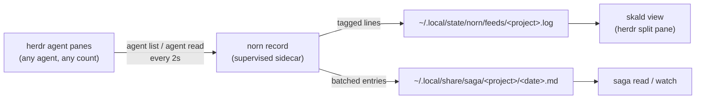

# Architecture — the norn project

> norn captures what a project's agent panes actually do; **skald** tells it
> live; **saga** keeps it for later. One capture engine, two consumers.

## Why it exists

A project with five agent panes has five scrollbacks and no story. Merging raw
terminal streams is a lie (alternate-screen TUIs repaint; there is no linear
scrollback inside a pane). So norn works at the *rendered-text* level: it polls
each pane's visible screen and appends only lines that are genuinely new.

## Crates

| Crate | Kind | Job |
|---|---|---|
| `norn-domain` | library | Pure domain logic: `RosterEntry`, `PaneEvent`, the overlap diff (`new_lines`), remote→project mapping. **No I/O.** |
| `norn-core` | library | The capture engine: herdr CLI roster/read shell-outs, project resolution, feed + narrative appends, the `record` loop. |
| `norn` | binary | `norn record` (the capture daemon — supervised sidecar, never a pane) and `norn projects`. |
| `skald` | binary | `skald view` — the live merged feed, one tagged stream per project. The herdr pane entrypoint. |
| `saga` | binary | `saga read/watch` — the durable per-project dated markdown narrative. |

## The load-bearing rule

`norn_domain::new_lines` appends only the longest suffix/prefix overlap tail.
Identical screens append nothing; a wholesale repaint (no overlap) appends
nothing. Interleaved garbage is worse than a missed frame — a feed that lies
teaches the operator to stop reading it, and then it is not a feed at all.

## Data flow

## Operational rules

- **The recorder is a sidecar, not a pane** — systemd user unit or LaunchAgent
  (the estate rule, learned the hard way on ceres 2026-10-06: a server that
  lives in a pty dies with the pty).
- **Read-only against herdr.** norn never sends input to a pane. Capture uses
  `agent list` and `agent read --source visible` only.
- **No credentials, no network.** Everything norn writes stays in the local
  state/data dirs. Pane content can carry secrets; treat the feed and
  narrative files like terminal history (0600 dirs, never committed).
- **First contact is not news.** A pane's pre-existing screen is not appended
  (empty `prev` ⇒ no output); the feed starts at the first *change*.

## Relationship to dagr

dagr renders the *declared* run (agents write run.json against a contract).
norn/saga record the *observed* work (no agent cooperation needed). They
compose: dagr is the plan, saga is the record.
